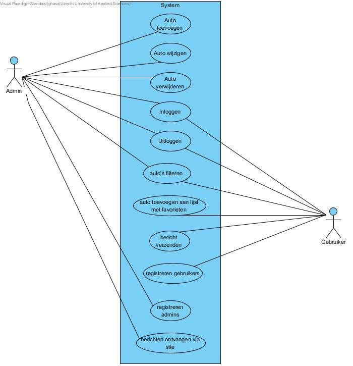
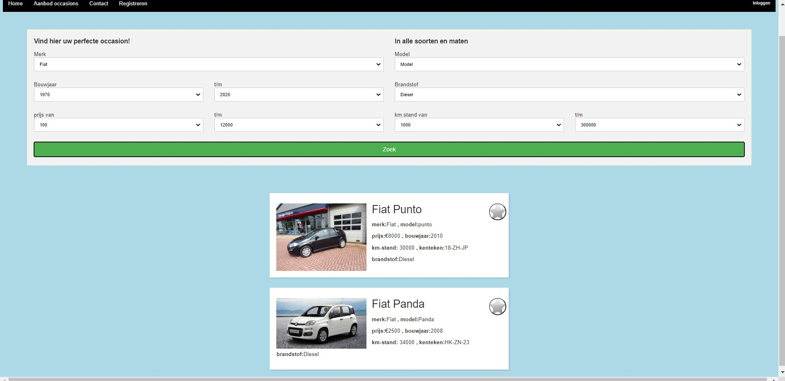
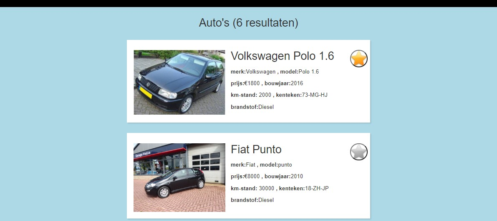
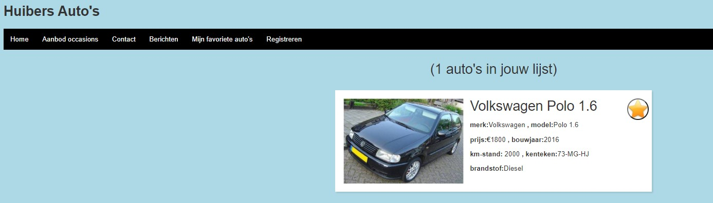
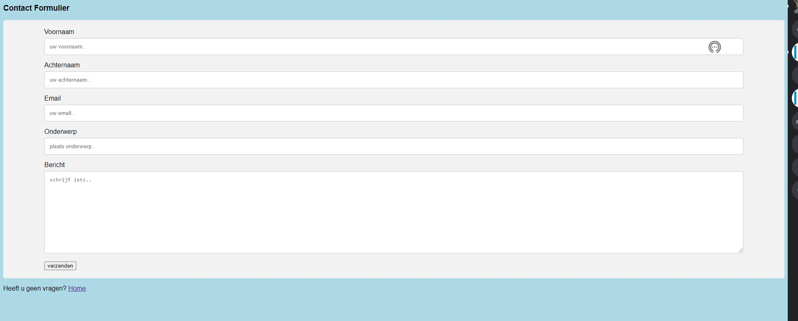
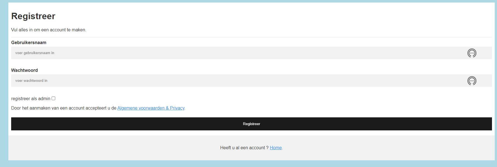
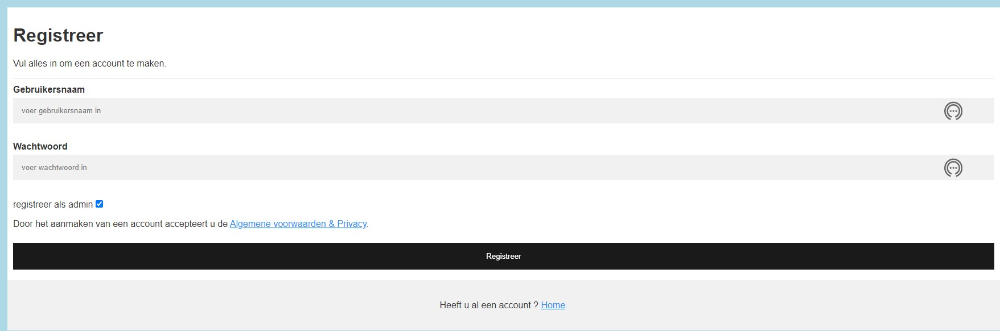
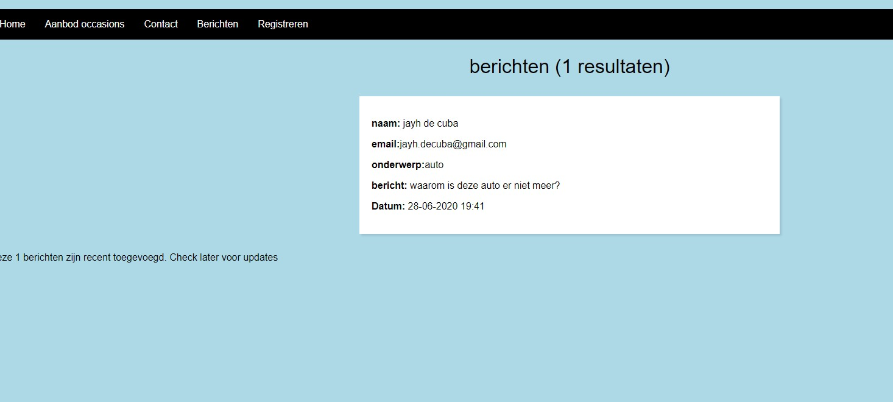

IPASS – Ontwerpdocument
=======================

***Ipass occasions project***

| Datum      | 28-06-2020 |
|------------|------------|
| __Versie__ | _0_.2     |
| __Auteur__ | __Jayh de Cuba__   |

---

# Inhoud
 - [1 Inleiding](#1-inleiding)
   - [§1 Doelgroep (optioneel)](#§1-doelgroep-(optioneel))
   - [§2 Leeswijzer (optioneel)](#§2-leeswijzer-(optioneel))
 - [2 Overzicht](#2-overzicht)
 - [3 Use Cases](#3-use-cases)
   - [§1 Actoren](#§1-actoren)
   - [§2 Use Case Templates](#§2-use-case-templates)
   - [§3 Wireframes](#§3-wireframes)
 - [4 Domeinmodel](#4-domeinmodel)
 - [5 Technologieën](#5-technologieën)
 - [6 Overdracht](#6-overdracht)
 - [7 Referenties](#7-referenties)

---

# 1 Inleiding
In de eerste periode van het 1e leerjaar ICT had ik een gesprek met mijn nicht. Het ging over het maken van websites en apps voor bedrijven en hoe leuk het mij leek om dat later als baan te hebben. Zij vertelde mij dat ze als hobby auto’s inkocht in Duitsland en het dan weer door verkocht in Nederland met als eindresultaat winst. De hobby werd uiteindelijk  een succes en transformeerde in een klein occasions bedrijf (Huibers Auto’s) in 2017. Bij Huibers Auto’s werken mijn nicht (als bijbaan) en haar man. Haar man verkoopt de auto’s en mijn nicht doet de administratie. 

Huibers auto’s komt aan klanten door mond tot mond reclame en een Facebookpagina dat contactgegevens bevat. Helaas bevat het nog geen aanbod van de auto’s die zich daar actueel bevinden. Daarom vroeg mijn nicht mij om voor haar ooit een website te maken. 
Waarop ze zelf de auto’s kan plaatsen met daarvan alle gegevens, zodat toekomstige klanten meer informatie kunnen vinden van de auto’s  en de kwaliteit van de relaties met de klanten zullen stijgen. 

---

# 2 Overzicht
Korte beschrijving wat het systeem geacht wordt te doen. Eventueel indeling in subsystemen met een korte beschrijving van een subsysteem.

---

# 3 Use Cases

•	1. De admin kan een auto toevoegen. 
De admin voert een naam in, een afbeelding, km-stand, bouwjaar, prijs, en brandstof type. 

•	2. De admin kan  wijzingen aanbrengen aan de gegevens van de auto.
De admin kan bij de auto’s in het hoofdscherm op wijzigen klikken, dan kan ze alle gegevens wijzingen die genoemd worden in use case 1. 

•	3. De admin kan auto’s verwijderen.
De admin kan auto's verwijderen doormiddel van het invoeren van de kenteken van de auto.   

•	4. De admin kan berichten ontvangen van gebruikers  met en zonder account.
Er bestaat een tab met berichten en die is aanwezig alleen voor admins.

•	5. Zowel de admins als gebruikers kunnen inloggen. 
Het inloggen wordt gedaan met een emailadres en de daarbij horende wachtwoord. Als één van beiden niet werken dan zal er in het scherm een zin staan met: “wachtwoord en of emailadres kloppen niet. 

•	6. Zowel de admins als gebruikers kunnen uitloggen. 
Om uit te loggen kunnen zowel de gebruiker als de admin bovenin het hoofdscherm een knop vinden met uitloggen en daarop klikken. Daarna worden ze uitgelogd. 

•	7. De gebruiker kan zowel ingelogd als niet ingelogd  een bericht sturen naar een admin. 
De gebruikers drukken op het tabje contact en dan worden ze gevraagd om hun email adres (optioneel), naam, vraag/opmerking, onderwerp. 

•	8. De gebruiker kan auto’s in zijn/haar favorieten-lijst zetten. 
De gebruiker drukt op de button voeg toe als favoriet, dan wordt er een lijst gemaakt met favoriete auto’s die de gebruiker altijd kan bekijken.

•	9. Zowel voor de admins als de gebruikers moet er ook gefiltert kunnen worden op de verschillende aspecten die benoemt worden in use case 1. 

•	10 Registratie gebruikers. 
De gebruikers kunnen een account aanmaken met hun emailadres en zelfgekozen wachtwoord. 

•	11. Registratie door admins voor admins. 
Met een button registreren voor admins, kan alleen een admin een andere admin maken. 

## §1 Actoren
|Use Case : Auto toevoegen |   uitwerking  |
|----------|--------------|
| Rolnaam:        | admin     |
|  Functienaam:        | De functienamen van de eigenaar zijn auto's toevoegen   |
| Omschrijving van de rol: | De rol van de admin is om auto's toe te voegen aan het scherm.De auto's kunnen dan gezien worden door zowel gebruikers met account en gebruikers zonder account.       |
|  Uitoefenaren:  |  In de organisatie mogen alleen admins auto's toevoegen aan de lijst met auto's.        |

|  Use Case : Auto bewerken |   uitwerking  |
|----------|--------------|
| Rolnaam:        | admin     |
|  Functienaam:        | De functienamen van de admins zijn auto's wijzigen   |
| Omschrijving van de rol: | De rol van de eigenaar(admin) is om een auto te wijzigen doormiddel van het kenteken. Het kenteken is de id voor een auto, daarop wordt gezocht en daarmee kunnen alle andere waardes van de auto veranderd worden.        |
|  Uitoefenaren:  |  In de organisatie mogen alleen admins auto attributen wijzigen.       |

|  Use Case : Auto verwijderen |   uitwerking  |
|----------|--------------|
| Rolnaam:        | admin   |
|  Functienaam:        | De functienamen van de admin zijn auto's verwijderen   |
| Omschrijving van de rol: | De rol van de admin is om een auto te verwijderen doormiddel van het kenteken.       |
|  Uitoefenaren:  |  In de organisatie mogen alleen admins auto's verwijderen. | 

|  Use Case : Inloggen |   uitwerking  |
|----------|--------------|
| Rolnaam:        | admin en gebruiker   |
|  Functienaam:        | De functienamen van de gebruikers en admins zijn inloggen.  |
| Omschrijving van de rol: | De rol van de gebruikers en admins is om het account op te starten en weer af te sluiten. De functies zoals faviete auto's komen bij de gebruikers. Bij de admins komen er twee tabs bij auto functies en berichten en een checkbox om een andere admin aan te maken.     |
|  Uitoefenaren:  |  alleen gebruikers/admins met een account. | 

|  Use Case : Uitloggen |   uitwerking  |
|----------|--------------|
| Rolnaam:        | Admin en gebruiker   |
|  Functienaam:        | De functienamen van de gebruikers en admins zijn uitloggen.  |
| Omschrijving van de rol: | De rol van de gebruikers is voor gebruikers/admins met een account door op een knop te drukken niet meer ingelogd te zijn.      |
|  Uitoefenaren:  |  Alleen gebruikers/admins met een account. | 

|  Use Case : Auto's filteren |   uitwerking  |
|----------|--------------|
| Rolnaam:        |  Iedereen   |
|  Functienaam:        | De functienamen van alle gebruiker zijn filteren op attributen |
| Omschrijving van de rol: | De rol van het filteren is voor alle gebruikers met en zonder een account. Iedereen kan filteren op de attributen die in het Klasse-diagram in de klasse  CarFilter staan    |
|  Uitoefenaren:  |  Iedereen | 

|  Use Case : Auto toevoegen aan lijst met favorieten |   uitwerking  |
|----------|--------------|
| Rolnaam:        |   gebruikers  /admins |
|  Functienaam:        | De functienamen van alle gebruikers zijn   favoriete auto's |
| Omschrijving van de rol: | De rol van het toevoegen aan favorieten is voor alle gebruikers met en zonder een account.      |
|  Uitoefenaren:  |  gebruikers | 

|  Use Case : Bericht verzenden |   uitwerking  |
|----------|--------------|
| Rolnaam:        |   gebruikers  /admins |
|  Functienaam:        | De functienaam van iedereen die het gebruikt is contact.  |
| Omschrijving van de rol: | Er kan een bericht verzonden worden doormiddel van het contact formulier de berichten komen bij alle admins terecht. Admins kunnen geen berichten sturen naar gebruikers.      |
|  Uitoefenaren:  |  gebruikers en admins | 

|  Use Case : Registreer gebruikers |   uitwerking  |
|----------|--------------|
| Rolnaam:        |  iedereen |
|  Functienaam:        | De functienaam voor iedereen die mag registreren is registreren.  |
| Omschrijving van de rol: | iedereen kan registeren  als gebruiker  |
|  Uitoefenaren:  |  gebruikers en admins | 

|  Use Case : Registreer admins |   uitwerking  |
|----------|--------------|
| Rolnaam:        |  iedereen |
|  Functienaam:        | De functienaam voor admins   is registreren admins.  |
| Omschrijving van de rol: | Alleen admins kunnen doormiddel van een checkbox als ingelogd andere admins aanmaken.  |
|  Uitoefenaren:  |  admins | 

|  Use Case : Registreer admins |   uitwerking  |
|----------|--------------|
| Rolnaam:        |  iedereen |
|  Functienaam:        | De functienaam voor admins   is "berichten"  |
| Omschrijving van de rol: | Alleen admins kunnen berichten ontvangen.  |
|  Uitoefenaren:  |  admins | 

## §2 Use Case Templates

|  Use Case : Auto toevoegen |   uitwerking  |
|----------|--------------|
| id:        | OW01 v0.1   |
|naam:        |Auto toevoegen    |
|actoren:        | eigenaar   |

#####beschrijving
De eigenaar kan een auto toevoegen bestaande uit merk(i), model(i), kenteken(i), kentekenplaat(i), bouwjaar(i),prijs(i), kilometerstand(i)
,brandstof type(i) en een afbeelding Url van de auto(i). Het systeem controleert of de auto al in het systeem staat door het controleren van alle gegegens en daarna van het kentekenplaat. Als de auto nog niet in het systeem staat, worden de gegevens opgeslagen en staat er een nieuwe auto in de lijst. 

#####Scenario
|  nummer |   uitwerking  |
|----------|--------------|
|  1      |  Systeem vraagt om de volgende gegevens: merk(i), model(i), kenteken(i), kentekenplaat(i), bouwjaar(i),prijs(i), kilometerstand(i),brandstof type(i) en een afbeelding Url van de auto(i).|
|   2     | Eigenaar verstrekt deze gegevens.  |
|    3    | Systeem valideert de ingevoerde gegevens  |
|    4    | Als de auto bestaat in de list)  | 
|   5     | Systeem geeft foutmelding     |
|  6   |Systeem gaat verder met stap 1     |
|  7   |  Doe zolang er een auto toegevoegd wordt dat nog niet bestaat   |
|  8   |  als de auto nog niet bestaat wordt die toegevoegd aan de lijst met autos op aanbod occasions  |
|     |    |
|     |    |

|  Use Case : Auto bewerken |   uitwerking  |
|----------|--------------|
| id:        | OW01 v0.2   |
|naam:        |Auto bewerken   |
|actoren:        | Admin   |

#####beschrijving
De admin kan een auto bewerken doormiddel van het (i)kenteken. De attributen die te wijzigen zijn bestaan uit merk(i), model(i), kenteken(i), kentekenplaat(i), bouwjaar(i),prijs(i), kilometerstand(i)
,brandstof type(i) en een afbeelding Url van de auto(i). Het systeem controleert of de auto al in het systeem staat door het controleren van de kentekenplaat. Als de auto nog niet in het systeem staat worden de gegevens opgeslagen en staat de auto gewijzigd in de lijst. 

#####Scenario
|  nummer |   uitwerking  |
|----------|--------------|
|  1      |  Systeem vraagt om de volgende gegevens: bestaande kenteken(i), merk(i), model(i), kentekenNieuw(i), kentekenplaat(i), bouwjaar(i),prijs(i), kilometerstand(i),brandstof type(i) en een afbeelding Url van de auto(i).|
|   2     | admin verstrekt deze gegevens.  |
|    3    | Systeem valideert de ingevoerde gegevens.  |
|    4    | Als het kenteken niet past bij een auto uit de lijst en of gegevens zijn niet aangepast. 
|   5     | Systeem geeft foutmelding.    |
|  6   |Systeem gaat verder met stap 1.    |
|   7  |  auto wordt bewerkt aan de hand van de gegevens die veranderd zijn.        |
|     |    |

  Use Case : Auto verwijderen |   uitwerking  |
|----------|--------------|
| id:        | OW01 v0.3   |
|naam:        |Auto verwijderen   |
|actoren:        | Addmin   |

#####beschrijving
De eigenaar kan een auto verwijderen doormiddel van het (i)kenteken. Het systeem checkt of er een auto in het systeem staat met dat kenteken en als dat zo is wordt de auto verwijderd. 

#####Scenario
|  nummer |   uitwerking  |
|----------|--------------|
|  1      |  Systeem vraagt om de volgende gegevens:  kenteken(i), |
|   2     | admin verstrekt deze gegevens.  |
|    3    | Systeem valideert de ingevoerde gegevens.  |
|    4    | Als het kenteken niet past bij een auto uit de lijst. 
|   5     | Systeem geeft foutmelding.    |
|  6   |Systeem gaat verder met stap 1.    |
|   7  |  auto wordt verwijderd       |

  Use Case : Inloggen |   uitwerking  |
|----------|--------------|
| id:        | OW01 v0.4   |
|naam:        | Inloggen   |
|actoren:        | admin/gebruikers   |

#####beschrijving
Admins en gebuikers kunnen inloggen met het (i)wachtwoord en (i)gebruikersnaam. Het systeem checkt of er een gebruiker in het systeem staat met die gegevens en als er een account gevonden is komt er een popup met inloggen is gelukt. Ook zal de gebruiker meer tabs krijgen , de admin krijgt iets meer tabs dan de gerbuiker. Namelijk berichten en de CRUD-functies van auto's extra.

#####Scenario
|  nummer |   uitwerking  |
|----------|--------------|
|  1      |  Systeem vraagt om de volgende gegevens:  gebruikersnaam(i) en wachtwoord(i) |
|   2     | gebruiker/admin verstrekt deze gegevens.  |
|    3    | Systeem valideert de ingevoerde gegevens.  |
|    4    | Als de gegevens niet kloppen of er geen account is met deze gegevens |
|   5     | Systeem geeft foutmelding doormiddel van popup.    |
|  6   |Systeem gaat verder met stap 1.    |
|   7 |  Ingelogd als gebruiker of admin      |

  Use Case : Uitloggen |   uitwerking  |
|----------|--------------|
| id:        | OW01 v0.5   |
|naam:        |Uitloggen  |
|actoren:        | Addmin /gebruiker  |

#####beschrijving
Admins en gebuikers kunnen uitloggen doormiddel van een uitlog button. Bij het uitloggen wordt de lokale sleutel verwijderd waarmee is ingelogd. 

#####Scenario
|  nummer |   uitwerking  |
|----------|--------------|
|  1      |  gebruiker drukt op loguit) |
|   2     |   systeem checkt of button is ingedrukt en opent functie|
|    3    | Systeem valideert de functie |
|    4    | als er geen account is ingelogd 
|   5     | Systeem geeft foutmelding doormiddel van popup.    |
|  6   |Systeem gaat verder met stap 1.    |
|   7 |  gebruiker/admin is uitgelogd   |
|     |    |

 Use Case : Auto's filteren |   uitwerking  |
|----------|--------------|
| id:        | OW01 v0.6   |
|naam:        |Auto's filteren  |
|actoren:        | Addmin /gebruiker  |

#####beschrijving
Iedereen die de pagina bezoekt kan auto's filteren op (i)kilometerstand van, (i)kilometerstand tot, (i)prijs van, (i)prijs tot, (i)bouwjaar van, (i) bouwjaar tot, (i)type brandstof, (i)merk

#####Scenario
|  nummer |   uitwerking  |
|----------|--------------|
|  1      |  Systeem vraagt om de volgende gegevens:  (i)kilometerstand van, (i)kilometerstand tot, (i)prijs van, (i)prijs tot, (i)bouwjaar van, (i) bouwjaar tot, (i)type brandstof, (i)merk|
|   2     |  persoon drukt op de zoek button |
|    3    |    systeem valideert gegevens            |
|    4    | als er geen match van auto's is |
|   5     | Systeem geeft foutmelding doormiddel van popup.    |
|  6   |Systeem gaat verder met stap 1.    |
|   7 |  auto's worden getoond   |
|     |    |

 Use Case : Auto Toevoegen aan lijst met favorieten |   uitwerking  |
|----------|--------------|
| id:        | OW01 v0.7  |
|naam:        | Auto toevoegen aan lijst met favorieten 
|actoren:        | Addmin /gebruiker  |

#####beschrijving
Admins en gebruikers kunnen auto's toevoegen door op het sterretje te drukken in de hoek van een auto. Zij kunnen de lijst dan zien bij het tabje mijn favoriete auto's.

#####Scenario
|  nummer |   uitwerking  |
|----------|--------------|
|  1      |  gebruiker/admin drukt op de favoriet button|
|   2     |  als de auto niet al in favorieten staat wordt deze toegevoegd aan de lijst met favorieten |

 Use Case : Bericht verzenden |   uitwerking  |
|----------|--------------|
| id:        | OW01 v0.8   |
|naam:        |Bericht verzenden  |
|actoren:        | iedereen  |

#####beschrijving
Iedereen die de pagina bezoekt kan berichten verzenden ze kunnen met deze gegevens: (i)email, (i)onderwerp, (i)bericht, (i)naam een bericht sturen naar alle admins.
#####Scenario
|  nummer |   uitwerking  |
|----------|--------------|
|  1      |  Systeem vraagt om de volgende gegevens:  (i)email, (i)onderwerp, (i)bericht, (i)naam |
|    2    |    systeem valideert gegevens            |
|    3   | als de gegevens allemaal overeenkomen met berichten uit de lijst of als niet alle gegevens zijn ingevoerd |
|   4     | Systeem geeft foutmelding doormiddel van popup.    |
|  5 |Systeem gaat verder met stap 1.    |
|   6 |  bericht wordt verzonden naar alle gebruikers   |
|     |    |

 Use Case : registreer als gebruiker |   uitwerking  |
|----------|--------------|
| id:        | OW01 v0.9   |
|naam:        |registreer gebruikers  |
|actoren:        | iedereen  |

#####beschrijving
Iedereen die de pagina bezoekt kan zich registreren met deze gegevens: (i)gebruikersnaam, (i)wachtwoord.
#####Scenario
|  nummer |   uitwerking  |
|----------|--------------|
|  1      |  Systeem vraagt om de volgende gegevens:  (i)gebruikersnaam, (i)wachtwoord|
|    2    |    systeem valideert gegevens            |
|    3    | als de gegevens allemaal overeenkomen met  uit de lijst of als niet alle gegevens zijn ingevoerd |
|   4     | Systeem geeft foutmelding doormiddel van popup.    |
|  5   |Systeem gaat verder met stap 1.    |
|   6| normmale gebruiker account wordt aangemaakt.   |
|     |    |

 Use Case : registreer admins |   uitwerking  |
|----------|--------------|
| id:        | OW01 v0.10   |
|naam:        |registreer admins  |
|actoren:        | admins  |

#####beschrijving
Alleen admins kunnen andere admins registeren met deze gegevens: (i)gebruikersnaam, (i)wachtwoord en (i)checkbox
#####Scenario
|  nummer |   uitwerking  |
|----------|--------------|
|  1      |  Systeem vraagt om de volgende gegevens:  (i)gebruikersnaam, (i)wachtwoord (i)checkbox|
|    2   |    systeem valideert gegevens            |
|    3   | als het account al bestaat en of als er niet ingelogd is als admin  |
|   4     | Systeem geeft foutmelding doormiddel van popup.    |
|  5  |Systeem gaat verder met stap 1.    |
|   6 |  admin account wordt aangemaakt.   |
|     |    |

 Use Case : Berichten ontvangen |   uitwerking  |
|----------|--------------|
| id:        | OW01 v0.11   |
|naam:        |Berichten ontvangen  |
|actoren:        | admins  |

#####beschrijving
Iedereen die de pagina bezoekt kan berichten verzenden ze kunnen met deze gegevens: (i)email, (i)onderwerp, (i)bericht, (i)naam een bericht sturen naar alle admins.
#####Scenario
|  nummer |   uitwerking  |
|----------|--------------|
|  1      |  admin drukt op berichten knop |
|    2   |    systeem valideert gegevens            |
|    3   | berichten worden getoond |

## §3 Wireframes
use case: Auto toevoegen:

use case: Auto bewerken: 

use case: Auto verwijderen: 

use case: Inloggen /Uitloggen: 

use case: auto's filteren:

use case: auto's toevoegen aan favorieten lijst:

use case: bericht verzenden

use case: Registreer gebruiker: 

use case:registreer admin: 

use case:berichten ontvangen als admin:

---

# 4 Domeinmodel
Hieronder wordt er een afbeelding en een beschrijving gegeven van het klassediagram.

| Entiteit | Beschrijving |
|----------|--------------|
|  Car    |    De entiteit Car heeft de attributen: name, image, kilometre,yearOfManufacture, price en fuelType. |
| Account  |     De entiteit Account heeft de attributen: , password, username,role     |
|  Message  |    De eniteit Message heeft de attributen: topic, question, name, email, dateOfSend (daarin wordt de lokale tijd in opgeslagen).      |
|   CarFilter        |  De eniteit Carfilter heeft de attributen: (i)kilometerstand van, (i)kilometerstand tot, (i)prijs van, (i)prijs tot, (i)bouwjaar van, (i) bouwjaar tot, (i)type brandstof, (i)merk|        |

---

# 5 Technologieën
Voor het realiseren van de applicatie wordt gebruik van de volgende methodieken en technieken: UML, Java, HTML, CSS, J2EE (Servlets), Rest (Jax-RS), Applicatieserver 
& HTTP-protocol en een datastore. Frameworks zijn niet gebruikt. 

---

# 6 Overdracht

inloggen als admin: admin account met de gebruikersnaam jayh475 (zonder hoofdletter) met het wachtwoord 123. Dan kan er een Auto bewerkt worden door op het tabje Aanbod ocassions te drukken en dan staan er functies voor de CRUD van auto. 
Alle waardes dienen met een hoofdletter te beginnen (anders kan er niet gefiltert worden op auto's op de hoofdpagina als er een auto in de lijst staat).
Als er een auto toegevoegd moet worden dan kan er op de grijze ster gedrukt worden(er zit nog een bug in de 1e ster wordt geel als er op andere sterren wordt gedrukt). 
Om De favoriete auto's te bekijken kan er eerst weer op home gedrukt worden en dan op mijn favorieten. Dan is het weer mogelijk om favorieten uit de lijst te halen. 

Inloggen als gebruiker: gebruiker account met de gebruikersnaam gast met het wachtwoord 123. Als er is ingelogd is te zien dat het account geen berichten heeft en  geen crud functies bevat voor het manipuleren van de auto's.

---

# 7 Verwijzingen
Er is gebruik gemaakt van al het materiaal van de hogeschool Utrecht 

titel = getting json and putting it in html. 
youtube account: LearnWebCode 
https://www.youtube.com/watch?v=DG4obitDvUA

how to center an object 
https://css-tricks.com/quick-css-trick-how-to-center-an-object-exactly-in-the-center/

https://stackoverflow.com/questions/14976495/get-selected-option-text-with-javascript

static logbinder voor tomcat errors
https://stackoverflow.com/questions/7421612/slf4j-failed-to-load-class-org-slf4j-impl-staticloggerbinder

login page
https://medium.com/swlh/how-to-create-your-first-login-page-with-html-css-and-javascript-602dd71144f1

replace object 
https://www.w3schools.com/howto/tryit.asp?filename=tryhow_js_redirect_webpage

register form 
https://www.w3schools.com/howto/tryit.asp?filename=tryhow_css_register_form

session storage 
https://www.youtube.com/watch?v=RxUc6ZWwgfw&t=192s

filteren met selectbox
https://codereview.stackexchange.com/questions/140420/filter-options-of-select-box-using-input-box-value

popup login 
https://www.w3schools.com/howto/tryit.asp?filename=tryhow_js_popup_form

junit throw argument test
https://www.baeldung.com/junit-assert-exception

converting markdown to pdf
https://superuser.com/questions/689056/how-can-i-convert-github-flavored-markdown-to-a-pdf

dateTimeFormatter
https://howtodoinjava.com/java-date-and-time-apis/

verander alle getelementsbyClassname displays
https://stackoverflow.com/questions/45012378/cant-change-style-display-using-getelementbyclassname

